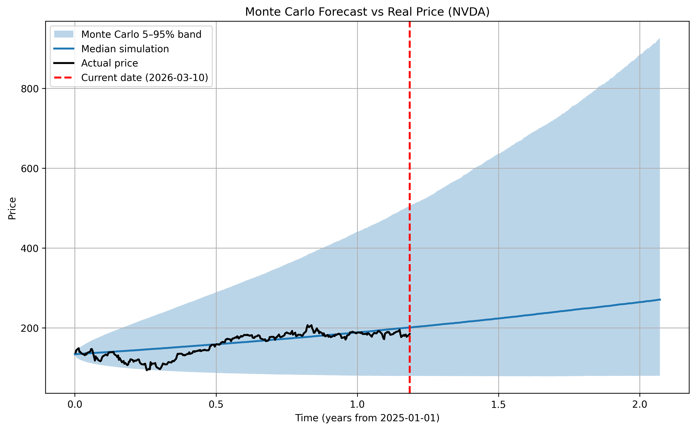

# Monte Carlo Stock Simulation

This project implements a Monte Carlo simulation framework using Geometric Brownian Motion (GBM) to model potential future stock price paths.

Features:
- Historical drift and volatility estimation
- 10,000 Monte Carlo simulated price paths
- Probability analysis of terminal prices
- Comparison of simulated paths with real market data

Example output:

